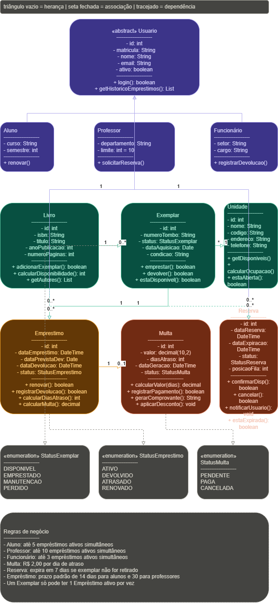
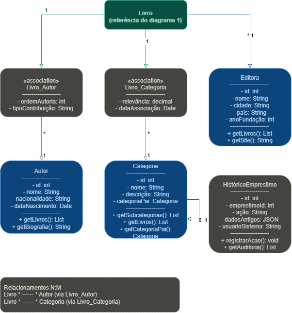
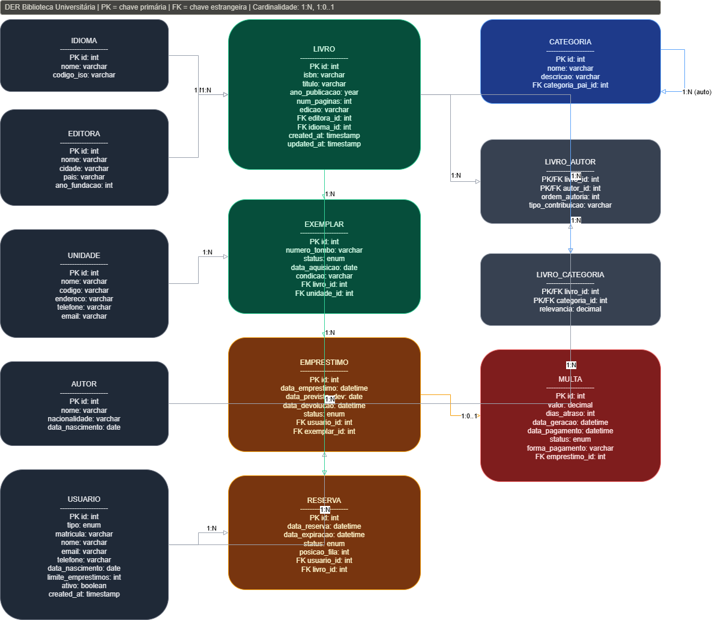
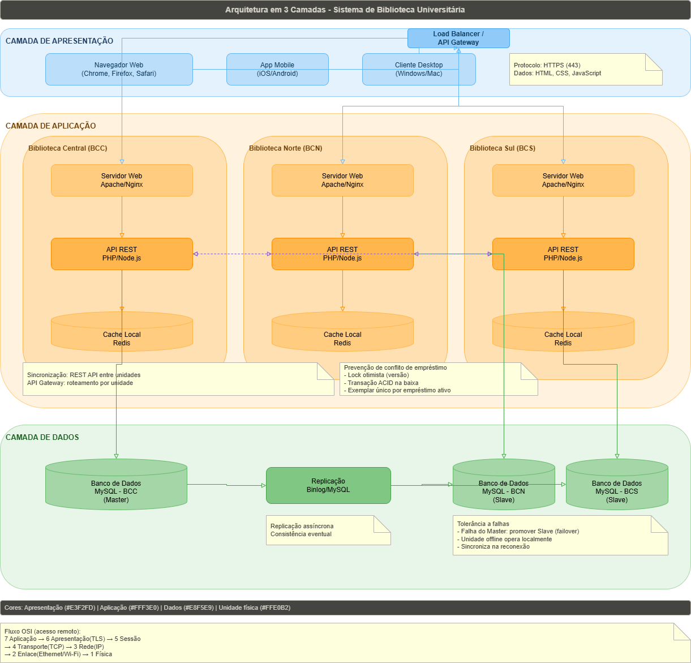
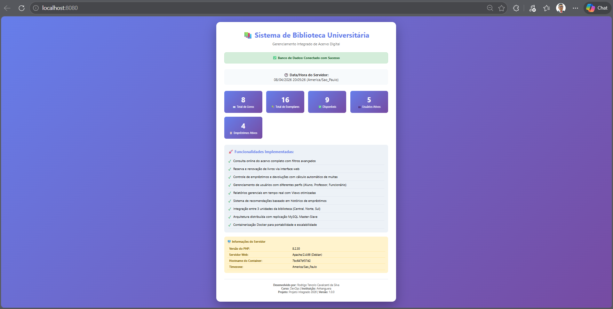
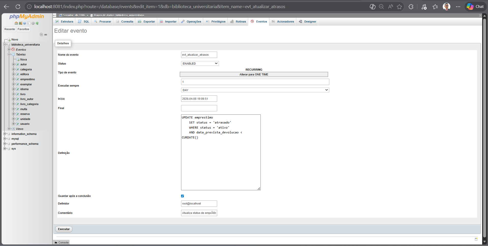
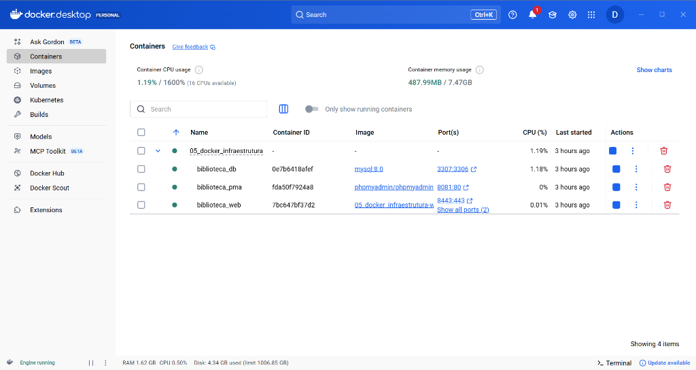

# SISTEMA DE GERENCIAMENTO DE BIBLIOTECA UNIVERSITÁRIA DIGITAL

> Projeto acadêmico desenvolvido para o curso de Tecnologia em DevOps, com aplicação prática de modelagem UML, banco de dados relacional, sistemas distribuídos e containerização com Docker.

| **Autor** | Rodrigo Tenorio Cavalcanti da Silva |
|---|---|
| **Instituição** | Anhanguera Educacional |
| **Curso** | Tecnologia em DevOps |
| **Disciplina** | Projeto Integrado Inovação — DevOps |
| **Semestre** | 1º Semestre de 2026 |
| **Local / Data** | Itapevi — São Paulo, Abril de 2026 |

---

## SUMÁRIO
1. [INTRODUÇÃO](#1-introdução)
2. [TAREFA 1 — DIAGRAMA DE CLASSES UML](#2-tarefa-1--diagrama-de-classes-uml)
3. [TAREFA 2 — MODELO ENTIDADE-RELACIONAMENTO](#3-tarefa-2--modelo-entidade-relacionamento)
4. [TAREFA 3 — SCRIPTS SQL](#4-tarefa-3--scripts-sql)
5. [TAREFA 4 — REDES E SISTEMAS DISTRIBUÍDOS](#5-tarefa-4--redes-e-sistemas-distribuídos)
6. [TAREFA 5 — INFRAESTRUTURA ÁGIL COM DOCKER](#6-tarefa-5--infraestrutura-ágil-com-docker)
7. [CONSIDERAÇÕES FINAIS](#7-considerações-finais)
8. [REFERÊNCIAS](#8-referências)

---

## 1. INTRODUÇÃO
O presente projeto tem como foco o desenvolvimento da arquitetura e modelagem primária de um Sistema de Gerenciamento de Biblioteca Universitária Digital, capaz de suportar operações em três unidades diferentes (Central, Norte e Sul). As atividades contemplam o desenho da arquitetura orientada a objetos (UML), a modelagem de entidades (DER e SQL), o planejamento da arquitetura de implantação em redes e a virtualização de uma prova de conceito web através do Docker.

A solução proposta adota uma arquitetura distribuída em três camadas, containerizada com Docker e sustentada por um banco de dados MySQL normalizado até a Terceira Forma Normal (3FN). O sistema permite consulta online do acervo completo, reserva e renovação de livros via web, controle automatizado de empréstimos e multas, gerenciamento de múltiplos perfis de usuário e geração de relatórios gerenciais em tempo real.

### 1.1 Ferramentas Utilizadas
- **Draw.io**: Elaboração dos diagramas UML e Modelo Entidade-Relacionamento (MER).
- **MySQL 8.0**: Sistema de gerenciamento de banco de dados relacional.
- **Docker e Docker Compose**: Ferramenta de conteinerização do ambiente web e do banco de dados.
- **Apache + PHP 8.2**: Servidor web e linguagem backend para a lógica da aplicação.

---

## 2. TAREFA 1 — DIAGRAMA DE CLASSES UML

### 2.1 Diagrama Principal
O diagrama de classes principal exibe a arquitetura central da biblioteca, organizando o escopo de atuação e as relações entre as entidades fundamentais do negócio de acordo com as regras estabelecidas.

  
*Figura 1 — Diagrama de Classes UML: núcleo do sistema.*

### 2.2 Diagrama Suporte
O diagrama de suporte detalha interações secundárias, processos de herança de Usuários (Aluno, Professor, Funcionário) e composições focadas nos exemplares e unidades físicas.

  
*Figura 2 — Diagrama de Classes UML: classes de suporte e associativas.*

### 2.3 Classes e Métodos
O sistema é composto por classes concretas e abstratas, com pelo menos 3 métodos por classe, garantindo encapsulamento e coesão.

| Classe | Métodos Principais |
|--------|---------------------|
| `Livro` | `calcularDisponibilidade()`, `getAutores()`, `adicionarExemplar()` |
| `Exemplar` | `emprestar()`, `devolver()`, `estaDisponivel()` |
| `Usuario` (Abstrata) | `login()`, `getHistoricoEmprestimos()`, `calcularLimiteEmprestimos()` |
| `Aluno` | `renovar()`, `getEmprestimosAtivos()`, `verificarPendencias()` |
| `Professor` | `solicitarReserva()`, `getEmprestimosAtivos()`, `verificarPendencias()` |
| `Emprestimo` | `renovar()`, `calcularMulta()`, `registrarDevolucao()` |

> *Observação: Atributos declarados como privados (–), métodos públicos (+) e métodos de validação compartilhados como protegidos (#), garantindo encapsulamento conforme padrão UML/OMG (2017).*


---

## 3. TAREFA 2 — MODELO ENTIDADE-RELACIONAMENTO

### 3.1 DER Completo
Apresenta o fluxo relacional do banco de dados, evidenciando as restrições obrigatórias e garantindo escalabilidade para o modelo de acervo. O modelo contém 13 entidades, normalizado até a 3FN.

  
*Figura 3 — Diagrama Entidade-Relacionamento (DER) completo.*

| Entidade | Chave Primária | Atributos Relevantes | Relacionamento |
|----------|---------------|---------------------|----------------|
| `LIVRO` | `id` INT AI | `isbn`, `titulo`, `editora_id(FK)` | 1:N com `EXEMPLAR` |
| `USUARIO` | `id` INT AI | `tipo ENUM`, `matricula`, `email` | 1:N com `EMPRESTIMO` |
| `EMPRESTIMO` | `id` INT AI | `data_emprestimo`, `status` | 1:1 com `MULTA` |
| `AUTOR` | `id` INT AI | `nome`, `nacionalidade` | N:M via `LIVRO_AUTOR` |
| `EDITORA` | `id` INT AI | `nome`, `cidade`, `pais` | 1:N com `LIVRO` |
| `IDIOMA` | `id` INT AI | `nome`, `codigo_iso` | 1:N com `LIVRO` |
| `CATEGORIA` | `id` INT AI | `nome`, `categoria_pai_id` | Auto-relacionamento |
| `LIVRO_AUTOR` | `livro_id + autor_id` | `ordem_autoria`, `tipo_contribuicao` | Associativa N:M |

### 3.3 Normalização (3FN)
Demonstração das tabelas associativas criadas para mitigar redundâncias e aplicar as exigências rigorosas da 3ª Forma Normal, com `LIVRO_AUTOR` e `LIVRO_CATEGORIA` gerenciando relações N:M.

---

## 4. TAREFA 3 — SCRIPTS SQL

### 4.1 DDL (Data Definition Language)
Estrutura formal e arquitetura de criação do banco e das tabelas restritas do projeto. O arquivo completo `biblioteca_FINAL.sql` está disponível na pasta `04_BANCO_DADOS_SQL`.

```sql
CREATE TABLE livro (
    id INT AUTO_INCREMENT PRIMARY KEY,
    titulo VARCHAR(200) NOT NULL,
    isbn VARCHAR(13) UNIQUE NOT NULL
) ENGINE=InnoDB DEFAULT CHARSET=utf8mb4;

CREATE VIEW vw_emprestimos_ativos AS
SELECT u.nome, l.titulo, e.data_prevista_devolucao
FROM emprestimo e
JOIN usuario u ON e.usuario_id = u.id
JOIN exemplar x ON e.exemplar_id = x.id
JOIN livro l ON x.livro_id = l.id;
```

### 4.2 Consultas SQL Obrigatórias
Os scripts DML populam o banco com dados realistas (8 livros, 15 exemplares, 5 usuários). Abaixo, as 5 consultas solicitadas no sistema:

**Consulta 1 — Exemplares disponíveis por unidade:**
```sql
SELECT l.titulo, GROUP_CONCAT(DISTINCT a.nome SEPARATOR ', ') AS autores,
       l.isbn, un.nome AS unidade, ex.numero_tombo AS localizacao
FROM exemplar ex
JOIN livro l ON ex.livro_id = l.id
JOIN livro_autor la ON l.id = la.livro_id
JOIN autor a ON la.autor_id = a.id
JOIN unidade un ON ex.unidade_id = un.id
WHERE ex.status = 'disponivel' AND un.codigo = 'BCC'
GROUP BY l.id, l.titulo, l.isbn, un.nome, ex.numero_tombo
ORDER BY l.titulo;
```

**Consulta 2 — 5 livros mais emprestados nos últimos 6 meses:**
```sql
SELECT l.titulo, GROUP_CONCAT(DISTINCT a.nome SEPARATOR ', ') AS autores, 
       COUNT(e.id) AS total_emprestimos
FROM livro l
JOIN exemplar ex ON l.id = ex.livro_id
JOIN emprestimo e ON ex.id = e.exemplar_id
JOIN livro_autor la ON l.id = la.livro_id
JOIN autor a ON la.autor_id = a.id
WHERE e.data_emprestimo >= DATE_SUB(CURDATE(), INTERVAL 6 MONTH)
GROUP BY l.id, l.titulo
ORDER BY total_emprestimos DESC LIMIT 5;
```

**Consulta 3 — Usuários com empréstimos em atraso e multa calculada:**
```sql
SELECT u.nome AS usuario, u.matricula, u.tipo, u.email,
       l.titulo AS livro, e.data_prevista_devolucao,
       DATEDIFF(CURDATE(), e.data_prevista_devolucao) AS dias_atraso,
       DATEDIFF(CURDATE(), e.data_prevista_devolucao) * 2.00 AS valor_multa,
       un.nome AS unidade
FROM emprestimo e
JOIN usuario u ON e.usuario_id = u.id
JOIN exemplar x ON e.exemplar_id = x.id
JOIN livro l ON x.livro_id = l.id
JOIN unidade un ON x.unidade_id = un.id
WHERE e.status = 'atrasado'
ORDER BY dias_atraso DESC, valor_multa DESC;
```

**Consulta 4 — Histórico completo de empréstimos de um usuário:**
```sql
SELECT l.titulo, GROUP_CONCAT(DISTINCT a.nome SEPARATOR ', ') AS autor,
       e.data_emprestimo, e.data_prevista_devolucao, e.data_devolucao,
       CASE
           WHEN e.data_devolucao IS NULL AND e.data_prevista_devolucao < CURDATE() THEN 'EM ATRASO'
           WHEN e.data_devolucao IS NULL THEN 'ATIVO'
           WHEN e.data_devolucao > e.data_prevista_devolucao THEN 'DEVOLVIDO COM ATRASO'
           ELSE 'DEVOLVIDO'
       END AS status
FROM emprestimo e
JOIN usuario u ON e.usuario_id = u.id
JOIN exemplar x ON e.exemplar_id = x.id
JOIN livro l ON x.livro_id = l.id
JOIN livro_autor la ON l.id = la.livro_id
JOIN autor a ON la.autor_id = a.id
WHERE u.matricula = '2024001'
GROUP BY e.id ORDER BY e.data_emprestimo DESC;
```

**Consulta 5 — Livros que nunca foram emprestados:**
```sql
SELECT l.titulo, l.isbn, l.ano_publicacao
FROM livro l
WHERE l.id NOT IN (
    SELECT DISTINCT x.livro_id
    FROM emprestimo e JOIN exemplar x ON e.exemplar_id = x.id
)
ORDER BY l.titulo;
```

### 4.3 Triggers de Automação
Lógicas automáticas implementadas para gerar obrigações financeiras e atualizar status:
```sql
CREATE TRIGGER trg_gerar_multa
AFTER UPDATE ON emprestimo FOR EACH ROW
BEGIN
    IF NEW.data_devolucao > NEW.data_prevista_devolucao THEN
        INSERT INTO multa (emprestimo_id, valor, dias_atraso)
        VALUES (NEW.id, DATEDIFF(NEW.data_devolucao, NEW.data_prevista_devolucao) * 2.00, 
                DATEDIFF(NEW.data_devolucao, NEW.data_prevista_devolucao));
    END IF;
END;
```

### 4.4 Events Programados
Jobs automáticos executados internamente pelo motor do banco para atualizar registros em tempo base:
```sql
CREATE EVENT evt_atualizar_atrasos
ON SCHEDULE EVERY 1 DAY
DO UPDATE emprestimo SET status = 'atrasado'
   WHERE status = 'ativo' AND data_prevista_devolucao < CURDATE();
```

---

## 5. TAREFA 4 — REDES E SISTEMAS DISTRIBUÍDOS

### 5.1 Arquitetura em 3 Camadas
Projeto estrutural dividindo logicamente Apresentação, Lógica de Negócios (API/Servidor) e Persistência de Dados (Banco Analítico) para atender de forma simétrica as 3 bibliotecas do campus sob alta disponibilidade e balanceamento seguro.

  
*Figura 4 — Diagrama de arquitetura distribuída em 3 camadas.*

### 5.2 Sincronização de Dados, Concorrência e Tolerância a Falhas
* **Sincronização**: A base de dados principal utilizará a replicação MySQL configurada no modelo topológico `Master-Slave`, operando de forma bidirecional e assíncrona para garantir equivalência de informações entre as filiais.
* **Controle de Concorrência**: Prevenção ativa para locação simultânea do mesmo exemplar. Utiliza travas lógicas (locks transacionais otimistas do InnoDB) acionadas na transação web da reserva.
* **Tolerância a Falhas**: Operações amparadas contra quedas de rede nas filiais utilizando as réplicas lógicas (`binlog`), redirecionando tráfego imediatamente e sem indisponibilidade de serviço.

### 5.3 Fluxo Completo OSI — Reserva de Livro

| Camada | Nome | Ação no Cenário de Reserva |
|--------|------|---------------------------|
| 7 - Aplicação | HTTP/HTTPS | Navegador envia POST `/api/reservas` com JSON `{livro_id: 5, usuario_id: 2}` |
| 6 - Apresentação | TLS/JSON | Criptografia TLS 1.3 e formatação dos dados em JSON/UTF-8 |
| 5 - Sessão | Cookie/Session | Validação da sessão do usuário autenticado no PHP |
| 4 - Transporte | TCP | Conexão porta 443 via three-way handshake (SYN, SYN-ACK, ACK) |
| 3 - Rede | IP | Roteamento dos pacotes até o servidor distribuído da biblioteca central |
| 2 - Enlace | Ethernet/Wi-Fi | Transmissão via MAC Address na rede física local e switchs da matriz |
| 1 - Física | Cabos/Ondas | Conversão e pulsos elétricos ou ópticos transmitindo as informações binárias |

---

## 6. TAREFA 5 — INFRAESTRUTURA ÁGIL COM DOCKER

### 6.1 Estrutura do Projeto e Volumes (Dockerfile)
A infraestrutura foi dimensionada de modo seguro usando volumes virtuais mapeando `/var/www/html` em `05_DOCKER_INFRAESTRUTURA/`. O arquivo `Dockerfile` principal orquestra o servidor baseado na compilação oficial `php:8.2-apache` instalando mysqli e habilitando o rewrite mod.
  
```dockerfile
FROM php:8.2-apache
RUN apt-get update && docker-php-ext-install mysqli pdo pdo_mysql
ENV APACHE_DOCUMENT_ROOT=/var/www/html
EXPOSE 80
```

### 6.2 Comandos Fundamentais do Docker
Foram alocados sob CLI comandos executivos garantindo a implantação limpa:

```bash
docker build -t biblioteca .
docker run -d -p 8080:80 -v ${PWD}:/var/www/html biblioteca
```

### 6.3 Docker Compose — Orquestração Segura
Além do container isolado, subimos uma orquestração inteira vinculada ao `docker-compose.yml`, provendo balanceamento, healthcheck nativo com curl, e interface web via PHPMyAdmin.

```yaml
version: '3.8'
services:
  web:
    build: .
    ports:
      - "8080:80"
    volumes:
      - ./src:/var/www/html
    depends_on:
      - db
  
  db:
    image: mysql:8.0
    ports:
      - "3307:3306"
    environment:
      MYSQL_ROOT_PASSWORD: root
      MYSQL_DATABASE: biblioteca_universitaria
  
  phpmyadmin:
    image: phpmyadmin/phpmyadmin
    ports:
      - "8081:80"
```

A integridade do status do Apache é garantida via script de `/health_check.php` incluso no diretório interno retornando status HTTP 200 via formato JSON para validadores e proxies.

### 6.4 Página PHP com Data/Hora (Requisito do Enunciado)
O arquivo `src/index.php` exibe dinamicamente a data/hora do servidor e estatísticas do acervo:

```php
<?php
date_default_timezone_set('America/Sao_Paulo');
echo "<h1>Sistema de Biblioteca Universitária</h1>";
echo "<p>Data/Hora: <strong>" . date('d/m/Y H:i:s') . "</strong></p>";
// Conexão PDO e consultas de estatísticas...
?>
```
*O endpoint `/health_check.php` retorna JSON para monitoramento Docker.*

### 6.5 Evidências Práticas de Uso
A página web index renderizou as implementações dinâmicas através do PDO acessando o Localhost:

  
*Figura 5 — Interface Web rodando isoladamente no container Docker espelhado no Localhost:8080.*

  
*Figura 6 — Validação do container do phpMyAdmin (Localhost:8081) monitorando o evento automático de atrasos do banco de dados.*

  
*Figura 7 — Visão gerencial do Docker Desktop confirmando a orquestração ativa e saudável dos 3 containers do projeto.*

---

## 7. CONSIDERAÇÕES FINAIS
O desenvolvimento analítico e estruturado deste Sistema Web de Gerenciamento de Biblioteca Digital permitiu a integração prática e simultânea dos conhecimentos adquiridos ao longo do curso nas frentes de Análise Orientada a Objetos, SQL, Redes, Tolerância a Falhas e conteinerização DevOps. Dentre os maiores aprendizados consolidados durante esta empreitada, enfatizam-se não apenas os fluxos de herança, abstração relacional de dados até a 3ª Forma Normal, mas a percepção ampla da necessidade de transações lógicas seguras que impeçam estresse local em redes acadêmicas distribuídas.

Como trabalhos contínuos futuros, identificam-se a evolução das API em NodeJS, controle de autenticação descentralizada (OAUTH) e a implementação de logs abertos em pipelines de CI/CD para GitHub Actions, visando amadurecer ainda mais as rotinas de Deploy do ambiente universitário. Conclui-se, portanto, que a competência atingida reflete o profissionalismo técnico exigido no cenário moderno de Engenharia de Confiabilidade (SRE) e Cultura DevOps.

---

## 8. REFERÊNCIAS
BOOCH, G.; RUMBAUGH, J.; JACOBSON, I. **UML: Guia do usuário**. 2. ed. Rio de Janeiro: Elsevier, 2006.

CODD, E. F. A relational model of data for large shared data banks. **Communications of the ACM**, v. 13, n. 6, p. 377-387, jun. 1970.

DATE, C. J. **Introdução a sistemas de bancos de dados**. 8. ed. Rio de Janeiro: Elsevier, 2004.

DOCKER INC. **Docker documentation: overview**. Disponível em: <https://docs.docker.com>. Acesso em: abr. 2026.

MYSQL. **MySQL 8.0 reference manual**. Disponível em: <https://dev.mysql.com/doc/refman/8.0>. Acesso em: abr. 2026.

TANENBAUM, A. S.; VAN STEEN, M. **Sistemas distribuídos: princípios e paradigmas**. 2. ed. São Paulo: Pearson Prentice Hall, 2016.